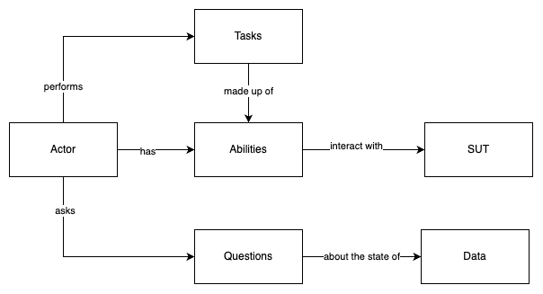

# ACCEPTANCE-TESTS

This repository contains acceptance tests to validate the functionality of the GitHub API. The tests are designed using Playwright and cover workflows including public and private endpoints, profile updates, repository and commit validations, and other typical API usage scenarios.

## Prerequisites

- Node.js (>= 22.x)
- NPM
- Playwright

## Environment Setup

1. **Clone the repository**:

   ```bash
   git clone https://github.com/squella/acceptance-tests.git
   cd acceptance-tests
   ```

2. **Install dependencies**:

   ```bash
   npm install
   ```

3. **Set up environment variables**:

   Environment variables are stored in the `.pre.env` file located in the `config/` directory. Ensure the following variables are defined:

   ```plaintext
   # config/.pre.env
   TOKEN=your_github_token
   USERNAME=your_github_username
   BASE_URL=https://api.github.com
   ```

   - `TOKEN`: Personal access token to authenticate GitHub API requests.
   - `USERNAME`: GitHub username to use for authenticated tests.
   - `BASE_URL`: Base URL of the GitHub API.

## Folder Structure

The project structure is organized as follows:

```plaintext
ACCEPTANCE-TESTS/
├── .github/
│   └── workflows/
│       └── playwright.yml           # GitHub Actions CI configuration
├── config/
│   └── .pre.env                     # Environment variables for the project
├── data/
│   └── responses/                   # JSON files with expected response data
├── node_modules/                    # Node.js dependencies
├── playwright-report/               # Playwright reports generated after tests
├── src/
│   ├── abilities/                   # Ability classes (e.g., API requests)
│   ├── actors/                      # Actor classes responsible for executing tasks
│   ├── questions/                   # Classes for response validations
│   └── tasks/                       # Task classes (e.g., fetch profile, update profile)
├── test-results/                    # Test results
├── tests/                           # API tests organized
├── .gitignore                       # Git ignored files and folders
├── package.json                     # NPM dependencies and scripts
├── playwright.config.ts             # Playwright configuration
└── tsconfig.json                    # TypeScript configuration
```

### Key Folders Explained

- **config/**: Contains the `.pre.env` file with required environment variables.
- **data/**: Contains expected response data (`responses/`) in JSON format, used for validations.
- **src/**:
  - **abilities/**: Defines specific abilities like `MakeApiRequests` for API interactions.
  - **actors/**: Defines actors and their configurations for modular test execution.
  - **questions/**: Contains classes that validate API responses against expected data.
  - **tasks/**: Defines specific tasks actors can perform, such as fetching or updating profile data.
- **tests/**: Contains API tests

## Project Flowchart

The following flowchart provides a high-level overview of the API testing workflow implemented in this project:




## Running Tests

Ensure all dependencies are installed and environment variables are correctly set in `config/.pre.env`.

1. **Run all tests**:

   ```bash
   npx playwright test
   ```

2. **Generate and view the test report**:

   After running the tests, view a detailed report using:

   ```bash
   npx playwright show-report
   ```

## Test Results

Detailed test reports are automatically generated in the `playwright-report/` folder. These reports provide insights into each test executed, the runtime, and results.

## Continuous Integration (CI) with GitHub Actions

This project includes a GitHub Actions workflow file located in `.github/workflows/playwright.yml`. This file configures an automated test run for every `push` or `pull request` to the repository.

### CI Execution in GitHub Actions

1. Each `push` or `pull request` triggers GitHub Actions to run the tests defined in `playwright.yml`.
2. Test results are accessible in the "Actions" section of your GitHub repository.


## Additional Notes

- **Pagination**: Some tests may need to handle pagination if the number of repositories or commits is high. Adjust the tests as needed.
- **Rate Limits**: Unauthenticated requests may be subject to rate limiting by the GitHub API. Consider this if running multiple tests.

---

This README provides a complete guide for setting up and running the project, as well as details on how CI is integrated with GitHub Actions.
